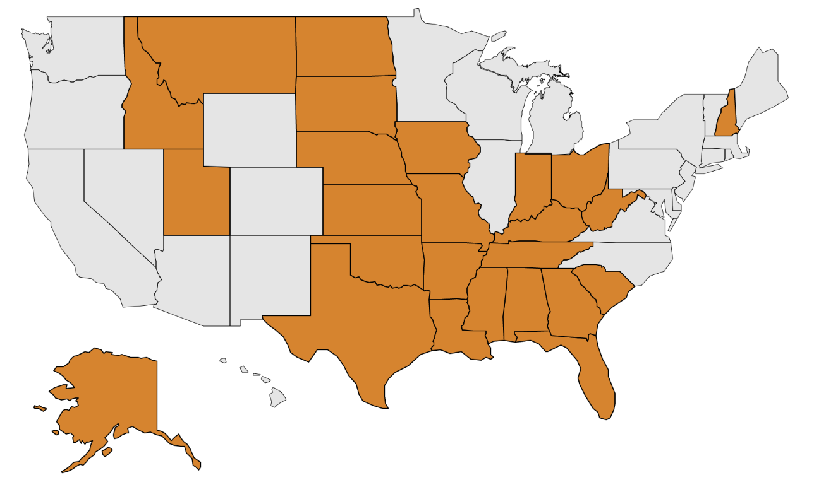

People all over the world are actively opposing vaccine enforcement.

Many people recognize that the government actions are not just about healthcare and that they also indicate a very troubling change in the roles of gov't around the world.

## Companies suing against mandates

* Daily Wire
  * [The Daily Wire Challenges Biden Administration Vaccine Mandate | The Daily Wire](https://www.dailywire.com/news/breaking-the-daily-wire-challenges-biden-administration-vaccine-mandate)
  * "The Dhillon Law Group, Inc. and Alliance Defending Freedom filed the legal challenge on behalf of The Daily Wire in the U.S. Court of Appeals for the 6th Circuit. The mandate requires all private employers of 100 or more employees to force unvaccinated employees to receive a COVID-19 vaccine, be subject to weekly testing, or lose their job. Attorneys for The Daily Wire will also file an emergency motion to stay the mandate."
  * “The Daily Wire will not comply with President Biden’s tyrannical vaccine mandate, and we are suing the Biden Administration to put a stop to their gross overreach,” said Daily Wire Co-Founder and Co-CEO Jeremy Boreing. “President Biden, the federal government, social media, and the establishment media have conspired to rob Americans of their freedoms in the name of public health. They have broken faith with the American people through conflicting messaging, false information, and by suppressing data and perspectives with which they disagree.”
* Jurgens manufacturing
  * “I would prefer the government stays out of it and does not throw around $14,000 penalties on businesses struggling to get through post pandemic,” Jack Schron, president of tool manufacturing company Jergens, told [The Wall Street Journal](https://www.wsj.com/articles/bidens-covid-19-vaccine-mandate-splits-business-community-11631285037). “We will support the individual with what they want to do with their body.”
* Lynden shipping
  * “If we lose people due to vaccination requirements, we will be unable to provide our essential services, and many of these services are critical for rural Alaska,” Jim Jansen, chairman of shipping company Lynden, told [Anchorage Daily News](https://www.adn.com/business-economy/2021/09/12/alaska-businesses-have-mixed-reactions-to-federal-vaccine-mandate/). “We are struggling with enough labor to do our jobs now and can’t withstand any people resigning over this.”
* Jamestown Plastics
  * “I think it’s bullshit,” Jay Baker, president of Jamestown Plastics in Brocton, New York, told [Reuters](https://www.reuters.com/world/us/few-cheers-many-worries-among-us-businesses-facing-covid-19-vaccine-test-mandate-2021-09-09/). “I’m not a fan of the federal government mandating anything.”
* National Federation of Independent Business
  * “Additional mandates, enforcement, and penalties will further threaten the fragile small business recovery,” Kevin Kuhlman, vice president of federal government relations at the National Federation of Independent Business, told [The Washington Post](https://www.washingtonpost.com/business/2021/09/10/biden-vaccine-mandate-workers-businesses/).
* Ohio Chamber of Commerce
  * “Whether it is the federal government or the Ohio legislature, one-size-fits-all government mandates limiting employer rights are not the right approach,” Ohio Chamber of Commerce president and chief executive officer Steve Stivers told [Cleveland.com](https://www.cleveland.com/open/2021/09/ohio-employers-and-republicans-criticize-president-joe-bidens-vaccine-mandate-wait-for-more-federal-guidance.html). “The Ohio Chamber will always stand up for the rights of employers to manage what is best for their own business, employees and customers.”
* Sources: [Here Are Some Of The Companies And Business Groups Pushing Back Against Biden’s Vaccine Mandate](https://www.citizensjournal.us/here-are-some-of-the-companies-and-business-groups-pushing-back-against-bidens-vaccine-mandate/)
* [Job Creators Network](https://thevirginiastar.com/2021/11/05/job-creators-network-suing-biden-administration-over-vaccine-mandate/)
  * “Today, Job Creator’s Network  (JCN), the nation’s leading small business advocacy organization, is filing a lawsuit today in the United States Court of Appeals for the Eighth Circuit against the Biden Administration to block the implementation of its vaccine mandate on small businesses,” JCN said in a press release. “JCN is filing this lawsuit together with some of its small business members—as well as an employee—represented by Boyden Gray and Associates, a law and strategy firm that includes former senior officials from the U.S. Departments of Justice and Labor.”
* United Airlines employees
  * Six United Airlines employees filed a federal lawsuit against the company this week seeking to block a COVID-19 vaccine mandate from going into effect. 
  * The complaint, filed Tuesday in a [Texas federal court](https://storage.courtlistener.com/recap/gov.uscourts.txnd.353477/gov.uscourts.txnd.353477.1.0.pdf), alleges that the company discriminated against employees who requested religious or medical accommodations.
  * The plaintiffs have asked for a temporary restraining order or a preliminary injunction on enforcing the order, followed by a permanent injunction.
* [Yost, others sue to stop vaccine mandate](https://www.vindy.com/news/local-news/2021/11/yost-others-sue-to-stop-vaccine-mandate/)
  * “A nationwide vaccine mandate that has nothing to do with workplace risk is a dangerous and unlawful use of executive power,” Yost, a Republican, said. “Congress has not given the president the power to make personal health care decisions for all Americans who just so happen to work at a company with at least 100 employees.”
  * The other attorneys general in the lawsuit also are Republicans and represent Kentucky, Idaho, Kansas, Oklahoma, Tennessee and West Virginia.
  
## States Suing Against Vaccine Mandates

* [11 states file suit against Biden COVID vaccine rule for private businesses](https://www.cbsnews.com/news/biden-covid-vaccine-mandate-states-lawsuit-businesses/)
  * "Missouri was joined in the lawsuit by the Republican attorneys general of Alaska, Arizona, Arkansas, Montana, Nebraska, New Hampshire, North Dakota, South Dakota and Wyoming. The office of Iowa Attorney General Tom Miller, a Democrat, also joined in the suit, along with several private, nonprofit and religious employers."
* [GOP state officials push back on employer vaccine mandate](https://apnews.com/article/covid-states-suing-employer-vaccine-mandates-f4300ed015ed716a1054949cf199a25a)
* [Here are the states suing the Biden administration over the employer vaccine mandate](https://www.kcra.com/article/here-are-the-states-suing-the-biden-administration-over-the-federal-vaccine-mandate/38175130)

## Public Protests and Declarations







https://twitter.com/BGOnTheScene/status/1445060388949725196

https://twitter.com/aginnt/status/1445096319199158275

https://twitter.com/M58193735/status/1445507988463124495

https://twitter.com/Networkinvegas/status/1432184834802139140